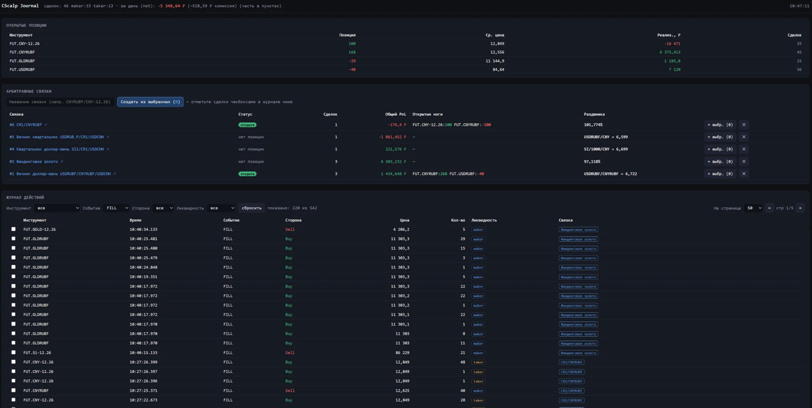
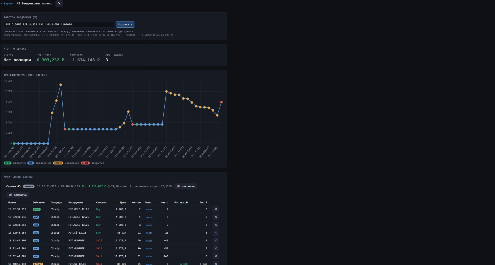

# CScalp Journal

**Русский** · [English](README.en.md)

Торговый дневник для скальпинга на MOEX FORTS через терминал **CScalp** (в составе FSR Launcher / привод к проп-дилингу). Пассивно читает собственные HTML-логи терминала и строит интерактивный дневник: котировки, выставленные заявки (мейкер/тейкер), исполнения, открытые позиции, арбитражные связки с PnL и комиссиями, публикация сделок в Telegram-канал.

> **Дисклеймер.** Неофициальный инструмент для личного учёта. Работает **только на чтение** отладочных логов, которые терминал пишет сам, — не вмешивается в его работу, не трогает протокол, не отправляет заявки. Не связан с CScalp, FSR или биржей. Используйте на свой риск.

**Windows, запуск в один клик:** [docs/УСТАНОВКА.md](docs/УСТАНОВКА.md) (файл `start.bat`).

## Скриншоты

Главная — позиции, арбитражные связки, журнал действий:



Страница связки — формула раздвижки, траектория PnL, разбивка по арб-сделкам:



## Документация

Подробное руководство по интерфейсу (каждый экран и поле): [docs/РУКОВОДСТВО.md](docs/РУКОВОДСТВО.md).

## Возможности

- **Журнал действий** — единая хронология: выставления (SUBMIT), снятия (CANCEL), исполнения (FILL). Фильтры по инструменту / событию / стороне / ликвидности, пагинация.
- **Мейкер/тейкер** — выводится из времени жизни заявки в стакане (флага в логах нет).
- **Открытые позиции** — берутся из состояния терминала (`OnPositionUpdate`) как источник истины, а не реконструируются из филлов.
- **Арбитражные связки** — вручную собираются из филлов + внешних ног (форекс-хедж). Сегментируются на отдельные арб-сделки (open→close), считается PnL в рублях (по стоимости шага цены), комиссия, раздвижка входа по редактируемой формуле (нотация TradingView), синтетическая цена при отсутствии форекс-ноги.
- **Комиссии** — модель проп-дилинга (мейкер 0,18 ₽/лот, тейкер = биржевой сбор ×1,8 + 0,18), сборы калибруются по реальному экспорту брокера.
- **Telegram** — ручная публикация открытия/закрытия арб-сделок в канал в формате вашего канала.

## Требования

- Терминал CScalp / FSR Launcher, пишущий HTML-логи (по умолчанию `C:\Program Files (x86)\FSR Launcher\SubApps\CS\Log`).
- Для Docker: Docker Desktop (Windows/macOS/Linux).
- Для локального запуска: Python 3.12+.

## Быстрый старт — Docker (рекомендуется)

```bash
git clone https://github.com/Aleksandrmvp/CScalp-Journal-MVP.git cscalp_journal
cd cscalp_journal
cp .env.example .env        # отредактируйте путь к логам и (опц.) Telegram
docker compose up -d --build
```

Дашборд: <http://localhost:8777>. Логи контейнера: `docker compose logs -f`, остановка: `docker compose down`.

Контейнер монтирует папку логов **только на чтение**, базу хранит в `./data`, часовой пояс — `Europe/Moscow` (важно: имена папок логов и «сегодня» считаются по локальному времени).

## Быстрый старт — локально (Windows)

```bash
python -m venv .venv
.\.venv\Scripts\pip install -r requirements.txt
.\.venv\Scripts\python -m cscalp_journal.web
```

Дашборд поднимется на <http://127.0.0.1:8777> с фоновым инжестом логов.

## Конфигурация (переменные окружения)

| Переменная | По умолчанию | Назначение |
|---|---|---|
| `CSCALP_LOG_ROOT` | `C:\...\CS\Log` | Папка с посуточными HTML-логами терминала |
| `CSCALP_DB` | `data/journal.sqlite` | Путь к SQLite-архиву |
| `CSCALP_WEB_HOST` / `CSCALP_WEB_PORT` | `127.0.0.1` / `8777` | Адрес дашборда |
| `CSCALP_POLL_SECONDS` | `2` | Интервал переинжеста логов |
| `TG_TOKEN` / `TG_CHAT_ID` | — | Telegram-бот (опц.); или файл `telegram.json` |

В Docker путь к логам на хосте задаётся через `CSCALP_LOG_ROOT_HOST` в `.env` (внутри контейнера он всегда `/logs`).

## Telegram (опционально)

1. Создайте бота у [@BotFather](https://t.me/BotFather), добавьте его администратором в канал.
2. Задайте `TG_TOKEN` и `TG_CHAT_ID` в `.env` — **или** скопируйте `telegram.json.example` в `telegram.json` и впишите туда.
3. Публикация — вручную кнопками 📢 на странице связки (автопостинга нет).

## Как это работает

Терминал пишет человекочитаемые отладочные логи, декодирующие бинарный протокол проп-дилинга. Парсер (`cscalp_journal/parser.py`) регулярками достаёт из них сделки, заявки, позиции и комиссии; инжест складывает их в SQLite идемпотентно (дедуп по TradeID). FastAPI отдаёт дашборд и JSON API; вся аналитика — в `views.py`.

Нюансы парсинга задокументированы в коде: дедуп на реконнектах, фильтрация стартового снимка позиций, ротация лога диспетчера в папку даты старта сессии (`Dispatcher_XDSD_00N.html`), ru-локаль чисел.

## Структура

```
cscalp_journal/
  parser.py       разбор HTML-логов
  ingest.py       инжест в SQLite (разово / в цикле)
  db.py           схема и апсерты
  views.py        аналитика: позиции, журнал, связки, сводка
  instruments.py  стоимости шага цены (пункт → рубли)
  formula.py      вычислитель формулы раздвижки + синтетика
  commission.py   модель комиссии проп-дилинга
  telegram.py     публикация в канал (stdlib)
  web.py          FastAPI-дашборд + HTML
prototype/        исходный PowerShell-прототип парсера
Dockerfile, docker-compose.yml
```

## Безопасность

`telegram.json`, `.env` и `data/` — в `.gitignore` и **никогда не коммитятся**. Токен бота — секрет; если он где-то засветился, отзовите/перевыпустите его у @BotFather.

## Лицензия

MIT — см. [LICENSE](LICENSE).
